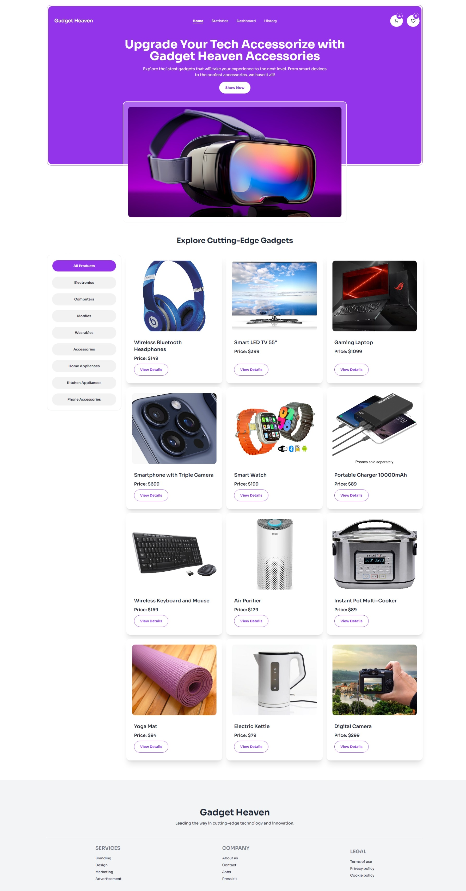
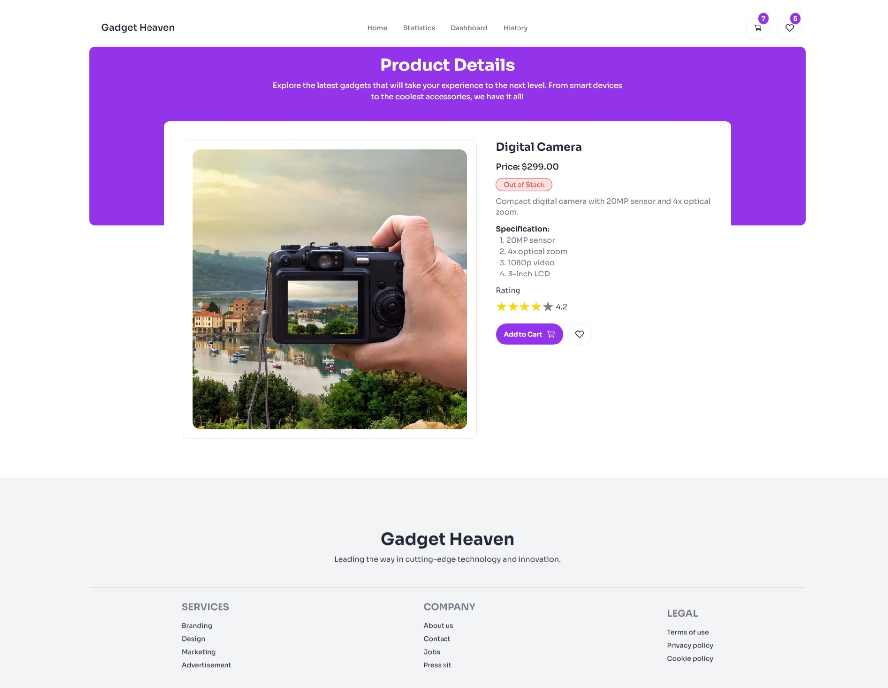
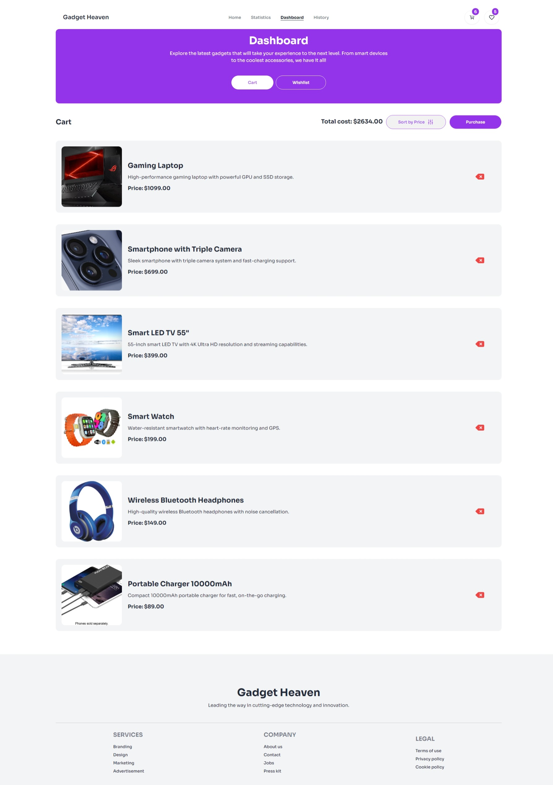
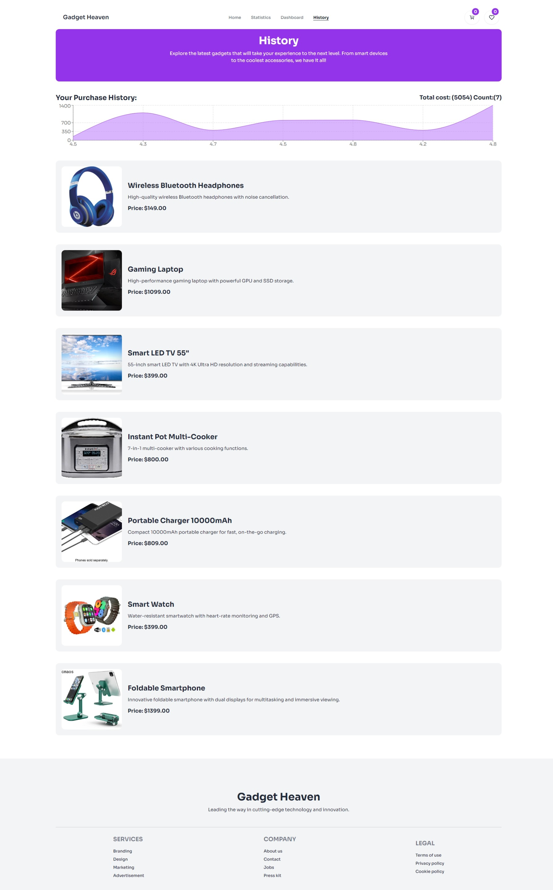

# Gadget Heaven E-commerce Website

Welcome to **Gadget Heaven**! This is an e-commerce website built using **React**, **Vite**, and **Tailwind CSS**. The project aims to provide users with an interactive online store for gadgets and accessories. The website features product listings, ratings, and a responsive design for a great user experience.

## Live Demo

Check out the live demo of the website:  
[**Gadget Heaven - Live**]( https://batch10-assignment-8.netlify.app)

## Screenshots:






## Features

- **Responsive Design**: Fully responsive design that works seamlessly on all screen sizes.
- **Product Listings**: Display of gadgets and their details, including images, descriptions, and prices.
- **Rating System**: Users can rate products using a star-based rating system.
- **Smooth Navigation**: Easy navigation using React Router for handling different routes.
- **Toast Notifications**: Provides users with notifications using React Toastify for actions like adding to the cart.

## Tech Stack

- **React**: JavaScript library for building user interfaces.
- **Vite**: Next-generation, fast build tool for frontend development.
- **Tailwind CSS**: Utility-first CSS framework for rapid UI development.
- **React Router DOM**: For handling client-side routing.
- **React Toastify**: For notifications.
- **React Icons**: For UI icons.

## Installation

To run the project locally, follow these steps:

1. **Clone the repository**:

   ```bash
   git clone https://github.com/akanshakaduskar/Gadget-heaven-ecommerce-website.git
